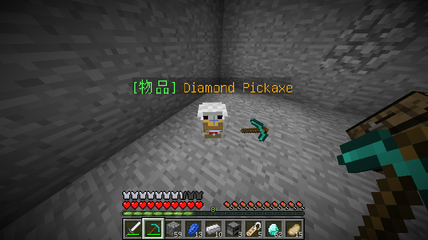

# PigeonChickenDupe

> 💡 **说明**：本插件是仿造 2b2t.xin 服务器的刷物品方法实现的，还原了经典的物品复制玩法。

PigeonChickenDupe是一个Minecraft服务器插件，提供两种物品获取方式：
1. **鸡的定时产出** - 将物品绑定到鸡身上，定期自动掉落
2. **生物击杀倍数掉落** - 将物品绑定到带箱子的生物（驴、骡子、羊驼），击杀时获得倍数掉落

## 安装

1. 前往 [Releases](https://github.com/2698269088/chicken-dupe/releases) 页面下载最新版本的插件。
2. 将插件文件复制到你的服务器插件目录中。
3. 启动服务器，插件将自动加载。

## 使用

### 基础操作
玩家手持任何物品，右键点击以下生物即可绑定：
- **成年的鸡** - 启用定时产出功能
- **带箱子的驴/骡子/羊驼** - 启用击杀倍数掉落功能

绑定后，生物头顶会显示物品名称，数据会自动保存。

### 功能一：鸡的定时产出
1. 右键点击已成年的鸡，绑定手中的物品
2. 插件会周期性地在鸡的位置掉落指定数量的物品
3. 鸡死亡时，相关数据会自动删除

### 功能二：生物击杀倍数掉落
1. 给驴、骡子或羊驼装备箱子
2. 右键点击该生物，绑定手中的物品
3. 击杀该生物时，所有掉落物数量会乘以配置的倍数（默认3倍）
4. 生物死亡后，相关数据会自动删除

## 配置

插件包含以下配置选项（位于 `config.yml`）：

### 功能开关
- **EnableChickenSpawn** - 是否启用鸡的定时产出功能（true/false，默认true）
- **EnableDropMultiplier** - 是否启用击杀倍数掉落功能（true/false，默认true）

### 鸡的定时产出配置
- **SpawnInterval** - 鸡掉落物品的间隔时间（秒，默认600）
- **SpawnNumber** - 每只鸡每次掉落的物品数量（默认1）
- **MaxChickensPerChunk** - 每个区块中最大可以出现几只刷物品的鸡（默认8，超过此数量的鸡将停止刷物品）

### 击杀倍数掉落配置
- **DropMultiplier** - 击杀带有仓库存储的生物时的掉落倍数（默认3倍）

> ⚠️ 注意：过高的数值可能导致服务器卡顿，请根据服务器性能调整配置。

修改配置后需要重启服务器才能生效。

## 支持

如有问题或建议，请提交 [issues](https://github.com/XzaiCloud/PigeonChickenDupe/issues)，我们会尽快回复。感谢您的支持！

## 版权和许可证

该插件基于 MIT License 开源，您可以自由使用、分发和修改本插件的代码。无需征得作者同意，但请保留原版权声明和许可证信息。
